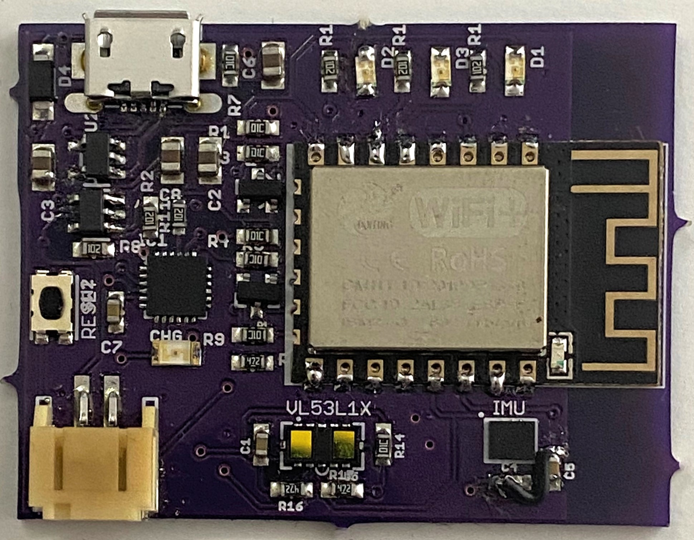
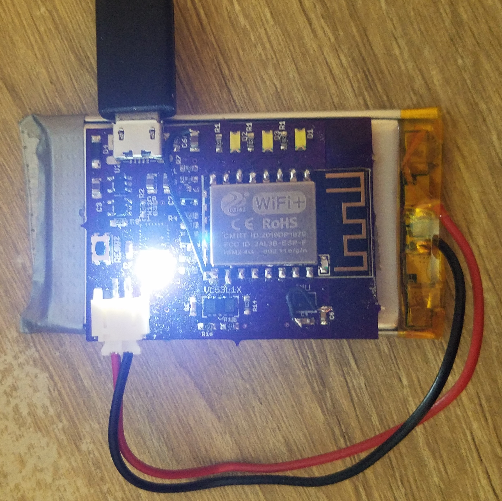
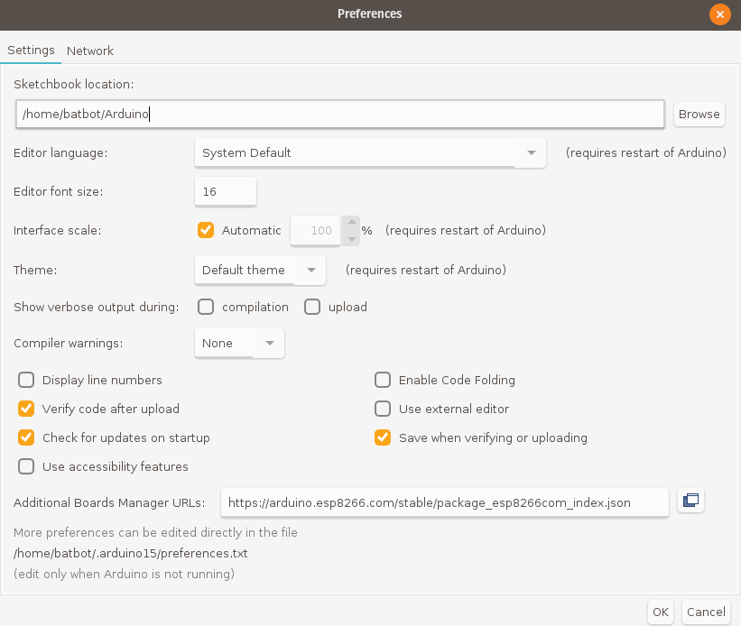
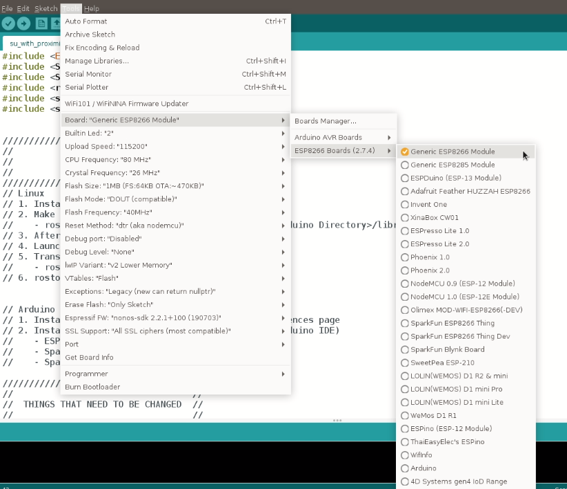
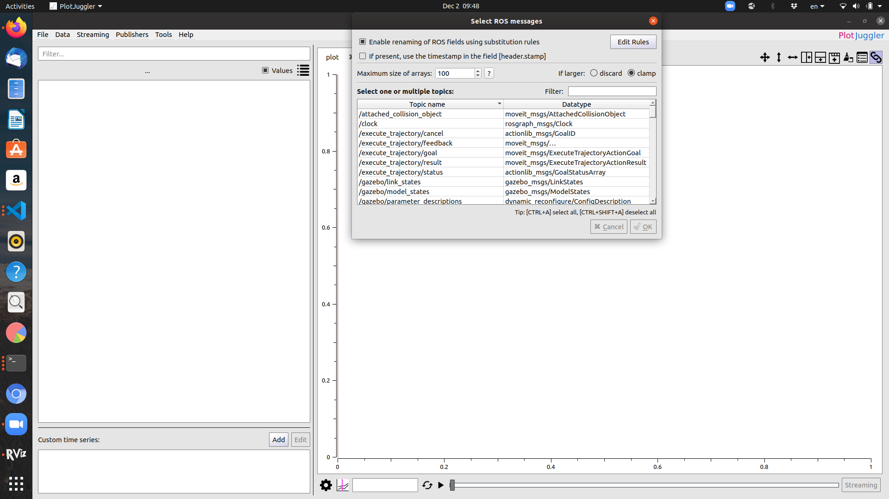
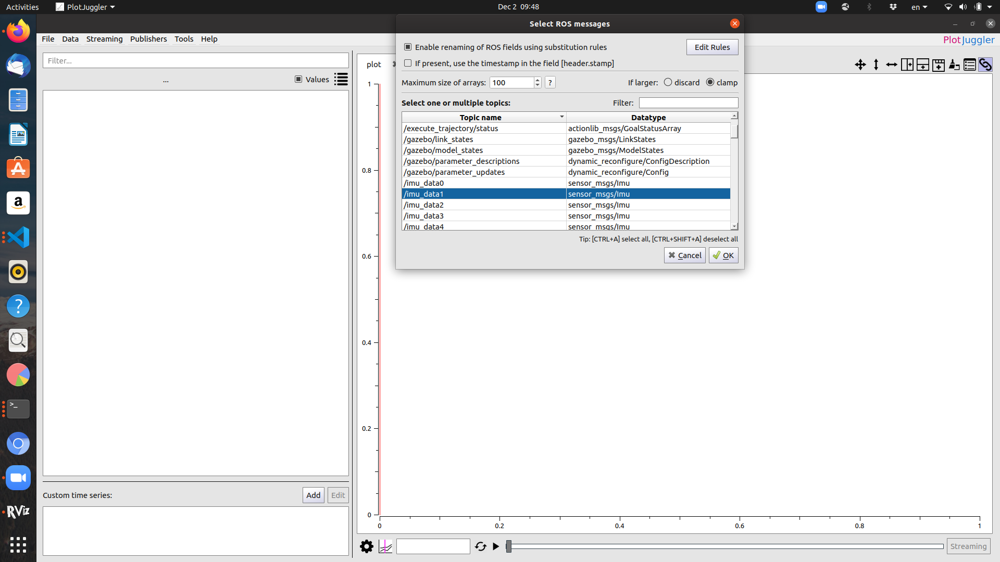
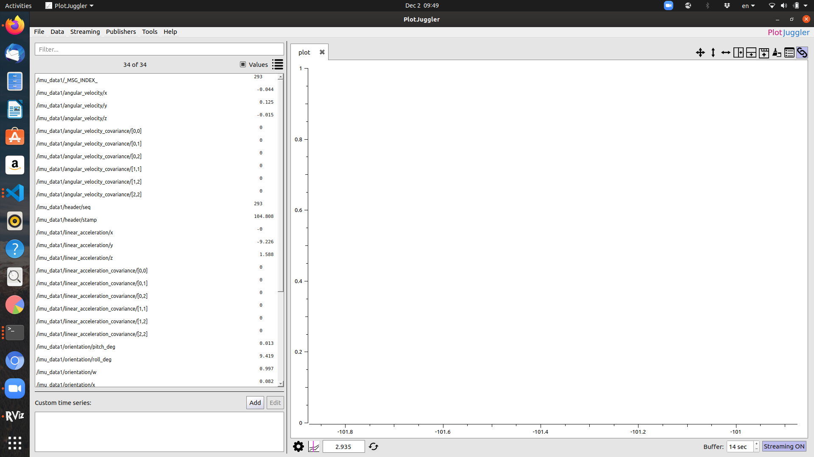
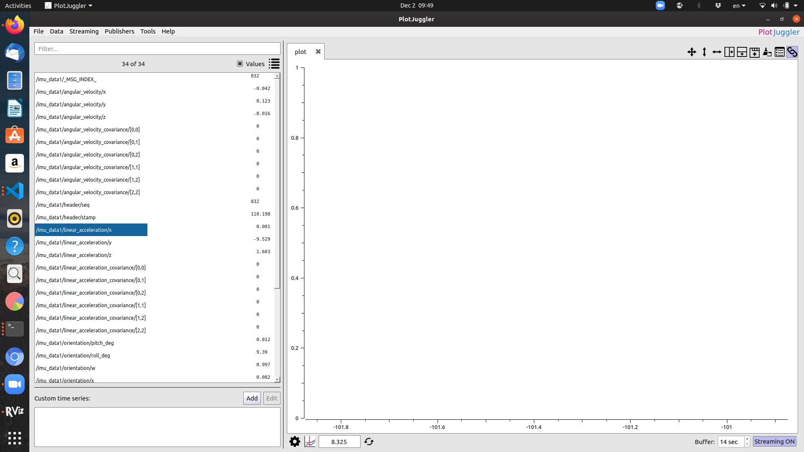
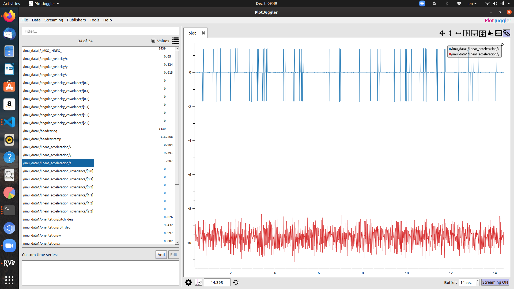

# HIRO Skin Unit Setup

Below is a guide on how to setup our own custom skin units.

The skin unit shown below will provide you with IMU `/imu_data#` and proximity `/proximity_data#` data over wifi by publishing data to ROS topics. In this tutorial we will demonstrate how to connect a given skin unit to your WiFi and view live data in ROS. 




## Hardware Setup
In order to complete all parts of this tutorial you should have access to: 

1. A sensor unit provided form the HIRO lab
1. [A USB to Micro connector](https://www.amazon.com/dp/B0711PVX6Z/ref=dp_prsubs_2)
1. [A battery](https://www.adafruit.com/product/258)


## Software Setup
We now outline the steps to make the sensor unit publish readings to a ROS topic over WiFi. 
1. [Download the Ardunio IDE](https://www.arduino.cc/en/software)
    * This will be used to upload code containing your network name and password
1. Clone this repository onto your computer with the command: 

```sh
git clone https://github.com/HIRO-group/skin_unit_setup.git
```
1. Connect the sensor unit to your computer with the USB to Micro connector so that code can be uploaded from the Arduino IDE
    * If you connect your battery to the sensor unit while it is plugged into your computer it will charge the battery
    * To show that the battery is charging a status LED will light up as seen below
    * At full battery the LED will turn off
    
1. In a terminal install [rosserial and rosserial-arduino](http://wiki.ros.org/rosserial_arduino/Tutorials/Arduino%20IDE%20Setup). If using ROS melodic run the following command or if you are using some other distro replace melodic with the output of `echo $ROS_DISTRO`:
    ```sh
    sudo apt-get install ros-melodic-rosserial-arduino
    sudo apt-get install ros-melodic-rosserial
    ```
   The rosserial package is used by the sensor unit to process data recived and parse it into a ros message. 

1. In the terminal utalize `rosserial-arduino` to create a `ros_lib` folder that Arduino will use to communicate with ROS. First navigate to the Ardunio libraries folder `cd YOUR_ARDUINO_LOCATION/libraries`, then run the following commands: 
    ```sh
    rm -rf ros_lib
    rosrun rosserial_arduino make_libraries.py .
    ```
1. Launch the Arduino IDE and install the [ESP8266 chip in the Arduino board manage](https://github.com/esp8266/Arduino#installing-with-boards-manager). In the Arduino IDE go to file->preferences and add `https://arduino.esp8266.com/stable/package_esp8266com_index.json` to the _Additional Boards Manager URLs_ as seen below.

    
    
1. Set the Arduino board to the newly installed Generic ESP8266 Module by following the path Tools->Board: "YOUR_CURRENT_BOARD"->ESP8266 Boards->Generic ESP8266 Module as seen below. 

    
   

1. Install the following libraries though your Arduino IDE by navigating to Sketch->Include Library->Manage Libraries and searching the following:
    * SparkFunLSM6DS3
    * SparkFun_VL53L1X
    
    The newly installed libraries shoule be visible at `YOUR_ARDUINO_LOCATION/libraries` as `Accelerometer_And_Gyroscope_LSM6DS3` and `SparkFun_VL53L1X_4m_Laser_Distance_Sensor` respectivly.
    
1. In the Arduino IDE and open the file `YOUR_CLONE_LOCATION/skin_unit_setup/su_with_proximity/su_with_proximity.ino`, this can be done by selecting file->open.

1. Set the following variables in the `su_with_proximity.ino`:
    * `const char* ssid     = "YOUR_NETWORK_NAME";`
    * `const char* ssid     = "YOUR_NETWORK_PASSWORD";`
    * `IPAddress server(10, 0, 0, 165);  // IP of the computer that will be resiving the data/`
    To find the IP Address of the your computer you can run the command `ifconfig` in your terminal. 


## Uploading New Code

For uploading new code, we highly recommend using the Arduino IDE, in which you can upload changed code to our skin units.

## Visualization using PlotJuggler

Once you are running the skin unit ROS publishers with `rosrun rosserial_python serial_node.py tcp` (make sure to run `roscore` in another terminal), you can echo out the data with:

```sh
# to view imu data:
rostopic echo /imu_data1

# to view proximity sensor data:
rostopic echo /proximity_data1
```

However, these commands don't *visually* show what the sensor is sensing, so we highly recommend using [PlotJuggler](https://github.com/facontidavide/PlotJuggler) to visualize your data.

To install and use PlotJuggler:

```sh
sudo apt install ros-${ROS_DISTRO}-plotjuggler-ros

# to run:
rosrun plot_juggler PlotJuggler
```

Upon running the above command, you'll be greeted with a cool meme, then a GUI that looks like this:


From here, click on `Streaming`, and then on `Start: ROS Topic Subscriber`. You should see something like this:



Select the topic you want, then click `OK`



Next, you'll see a list of updating (real time) topics:




You can select one topic:



Then, make sure to drag and drop the topic so you can see the below pic:


You can do this for multiple topics; for example, this is what the real time visualization of 2 skin unit IMU data topics looks like:




