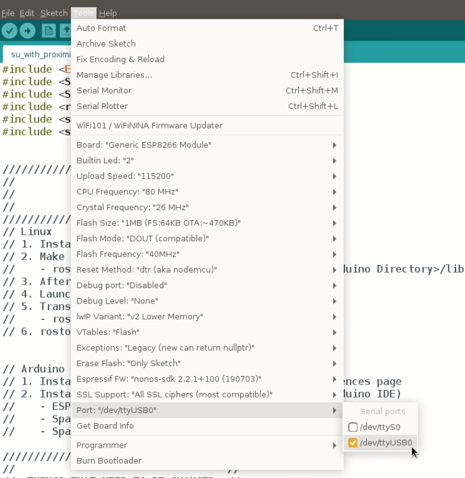

# HIRO Skin Unit Setup

Below is a guide on how to setup our own custom skin units.

The skin unit shown below will provide you with IMU `/imu_data#` and proximity `/proximity_data#` data over wifi by publishing data to ROS topics. In this tutorial, we'll demonstrate how to connect a given skin unit to your WiFi and view live data in ROS using PlotJuggler. 


Below is a picture of one of our V1 skin units:


## Hardware Setup
In order to complete all parts of this tutorial, you should have access to: 

1. A customer sensor unit provided form the HIRO lab
2. [A USB to Micro connector](https://www.amazon.com/dp/B0711PVX6Z/ref=dp_prsubs_2)
3. [A lithium polymer battery](https://www.adafruit.com/product/258)


## Software Setup
We now outline the steps to make the sensor unit publish readings to a ROS topic over WiFi. 
1. [Download the Arduino IDE](https://www.arduino.cc/en/software)
    * This will be used to upload code containing both your network name and password
2. Clone this repository onto your computer with the command: 

```sh
git clone https://github.com/HIRO-group/skin_unit_setup.git
```

1. Connect the sensor unit to your computer with the USB to Micro connector so that code can be uploaded from the Arduino IDE.
    * If you connect your battery to the sensor unit while it is plugged into your computer, it will charge the battery.
    * To show that the battery is charging, a status LED will light up (the colors may be different), as seen below:
    * At full battery, the LED will turn off.
    

**IMPORTANT**: Make sure the skin unit is connected to your computer! In order to validate this, you'll need to ensure that a new device shows up under the `\dev` folder. For example, you might see `\dev\ttyUSB0` show up. We elaborate how to debug later in this guide, under "Potential Issues and How to Resolve Them".

2. In a terminal, install [rosserial and rosserial-arduino](http://wiki.ros.org/rosserial_arduino/Tutorials/Arduino%20IDE%20Setup). If using ROS melodic run the following command or if you are using some other distro replace melodic with the output of `echo $ROS_DISTRO`:
    ```sh
    sudo apt-get install ros-melodic-rosserial-arduino
    sudo apt-get install ros-melodic-rosserial
    ```
   The rosserial package is used by the sensor unit to process data recived and parse it into a ros message. 
   
   You can also build the library from source if you want.

3. In the terminal, utilize `rosserial-arduino` to create a `ros_lib` folder that Arduino will use to communicate with ROS. First, navigate to the Arduino libraries folder: `cd YOUR_ARDUINO_LOCATION/libraries`; then, run the following commands: 
    ```sh
    rm -rf ros_lib # side note: this folder might not even exist, but do it
    rosrun rosserial_arduino make_libraries.py .
    ```
4. Launch the Arduino IDE and install the [ESP8266 chip in the Arduino board manage](https://github.com/esp8266/Arduino#installing-with-boards-manager). In the Arduino IDE, go to file->preferences and add `https://arduino.esp8266.com/stable/package_esp8266com_index.json` to the _Additional Boards Manager URLs_ as seen below.

    
    
5. Set the Arduino board to the newly installed Generic ESP8266 Module by following the path Tools->Board: "YOUR_CURRENT_BOARD"->ESP8266 Boards->Generic ESP8266 Module as seen below. 

    
   

6. Install the following libraries though your Arduino IDE by navigating to Sketch->Include Library->Manage Libraries and searching the following:
    * SparkFunLSM6DS3
    * SparkFun_VL53L1X
    
    The newly installed libraries shoule be visible at `YOUR_ARDUINO_LOCATION/libraries` as `Accelerometer_And_Gyroscope_LSM6DS3` and `SparkFun_VL53L1X_4m_Laser_Distance_Sensor`, respectivly.
    
7. In the Arduino IDE and open the file `YOUR_CLONE_LOCATION/skin_unit_setup/su_with_proximity/su_with_proximity.ino`, this can be done by selecting file->open.

8. Set the following variables in the `su_with_proximity.ino` file:
    * `const char* ssid     = "YOUR_NETWORK_NAME";`
    * `const char* ssid     = "YOUR_NETWORK_PASSWORD";`
    * `IPAddress server(10, 0, 0, 165);  // IP of the (your) computer that will be receiving the data`
    To find the IP Address of your computer, you can run the command, `ifconfig`, in your terminal.
    
9. Set the serial port to the port connected to your skin unit board though Tools->Port: "YOUR CURRENT PORT" -> and select the correct port. An example is given below; the port ID may be different depending on your setup. 
    
    
    
10. Click the Upload arrow at the top left of your Arduino IDE in order to upload your changed code to the skin unit.

11. In two terminal windows run `roscore` and `rosrun rosserial_python serial_node.py tcp`, you should now be able to view the proximity and IMU data my running `rostopic echo /proximity_data1` or `rostopic echo /imu_data1` 
   
    


## Uploading New Code

For uploading new code, we highly recommend using the Arduino IDE, in which you can upload changed code to our skin units.

## Visualization using PlotJuggler

Once you're running the skin unit ROS publishers with `rosrun rosserial_python serial_node.py tcp` (make sure to run `roscore` in another terminal), you can echo out the data with:

```sh
# to view imu data:
rostopic echo /imu_data1

# to view proximity sensor data:
rostopic echo /proximity_data1
```

**Note**: If you get this error when doing `rosrun`:

```python
NameError: global name 'BlockingIOError' is not defined
```

Then you'll need to directly call `python3` -- you'll need to `cd` into the directory where `serial_node.py` is (use `rospack list | grep rosserial_python` to find the location), then run:

```sh
python3 rosserial_python serial_node.py tcp
```

However, these commands don't *visually* show what the sensor is sensing, so we highly recommend using [PlotJuggler](https://github.com/facontidavide/PlotJuggler) to visualize your data.

To install and use PlotJuggler:

```sh
sudo apt install ros-${ROS_DISTRO}-plotjuggler-ros

# to run:
rosrun plotjuggler PlotJuggler
```

Upon running the above command, you'll be greeted with a cool meme, then a GUI that looks like this:


From here, click on `Streaming`, and then on `Start: ROS Topic Subscriber`. You should see something like this:


Select the topic you want, then click `OK`


Next, you'll see a list of updating (real time) topics:


You can select one topic:


Then, make sure to drag and drop the topic so you can see the below pic:


You can do this for multiple topics; for example, this is what the real time visualization of 2 skin unit IMU data topics looks like:


## Potential Issues and How to Resolve Them

We now list out issues that you may occur during this process.

- **Problem**: When trying to upload code, I get a `Permission Denied` error regarding the port that I'm trying to upload to.
- **Solution**: Here, you'll need to change the permissions of the port so that you can write to it. You can give it full permissions by: 

```sh
sudo chmod 777 /dev/<port that you want to write to>
```

- **Problem**: The port cannot be found.
- **Solution**: A probable cause of this may be a finicky connection. By this, you can check the output of `dmesg` to see what's going on. If you see a bunch of errors and no confirmation that you are connected, the issue may be with the connection of the board itself. For example, we encountered an error where we couldn't find a port, and the reason turned out to be that the port in the skin unit was finicky, which we resoldered.

- **Problem**: I'm not getting any sensor readings, but I'm connected to the network. What do I do?
- **Solution**: In this case, there might be an error with the sensor initialization. Check the return value of the sensor class' `begin()` function. If it's *not* 0, then it's an error. You can try resetting the skin unit as well (via the reset button).

- **Problem**: I'm not getting a connection over Wifi when running the serial node.
- **Solution**: This most likely is an issue with your Wifi, *or* the SSID and/or password is incorrect.

- **Problem**: The LED light to signify charging doesn't turn on when I plug the skin unit in to charge.
- **Solution**: The connection port on the skin unit may have problems here -- it's probably an issue with the skin unit, not your computer.


